# AWS Auto Scaling Project

## Overview

This project demonstrates a highly available and self-healing web application architecture on AWS using:

- Amazon EC2
- Launch Templates
- Auto Scaling Groups (ASG)
- Application Load Balancer (ALB)
- CloudWatch Monitoring

The infrastructure automatically scales based on CPU utilization and replaces unhealthy instances to maintain availability.

---

## Architecture Diagram

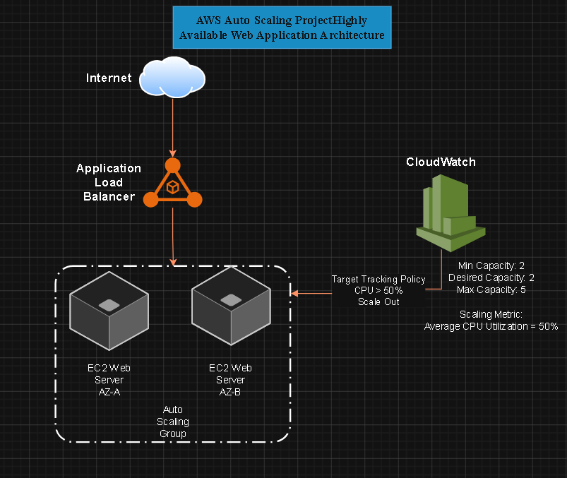

This architecture demonstrates a highly available web application deployed across multiple Availability Zones using an Application Load Balancer, Auto Scaling Group, EC2 instances, and CloudWatch-based scaling policies.

- [architecture-notes.md](architecture-notes.md)

---

## Features

- High Availability
- Automatic Scaling
- Load Balancing
- Health Checks
- Self-Healing Infrastructure
- CloudWatch Monitoring

---

## AWS Services Used

| Service | Purpose |
|----------|----------|
| EC2 | Application Servers |
| Launch Template | Instance Configuration |
| Auto Scaling Group | Automatic Scaling |
| Application Load Balancer | Traffic Distribution |
| CloudWatch | Monitoring & Metrics |
| Security Groups | Network Security |

---

## Networking Setup

The project uses a custom VPC with public subnets distributed across multiple Availability Zones.

### Components

- Custom VPC
- Public Subnet 1
- Public Subnet 2
- Internet Gateway
- Public Route Table

### Screenshots


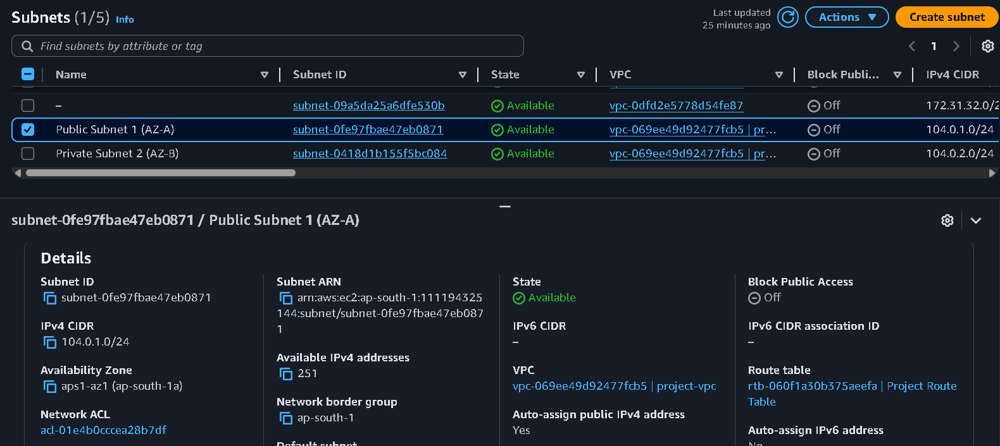
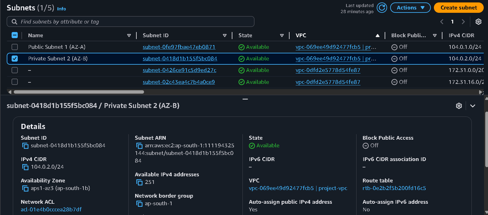


---

## Security Configuration

A dedicated security group was created for web servers.

### Inbound Rules

| Protocol | Port | Purpose |
|----------|------|----------|
| TCP | 22 | SSH Administration |
| TCP | 80 | HTTP Web Traffic |

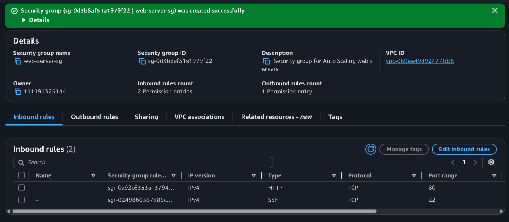

---

## EC2 Automation

A test EC2 instance was deployed to validate infrastructure automation.

### Bootstrap Process

The User Data script automatically:

- Updates packages
- Installs Apache
- Retrieves EC2 metadata
- Generates a dynamic webpage

### Validation

The deployed instance successfully generated a webpage displaying its own Instance ID.


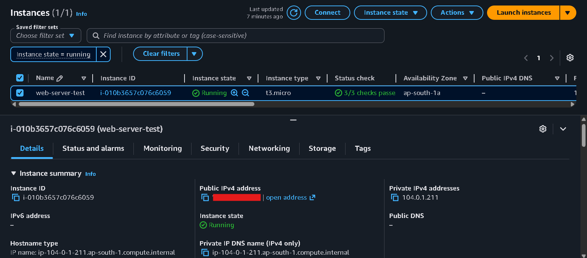
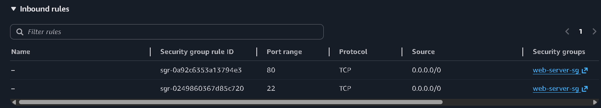


---

## Troubleshooting

### IMDSv2 Metadata Access Issue

During testing, metadata retrieval initially failed with:

```text
401 Unauthorized
```

The issue occurred because the EC2 instance required IMDSv2 authentication.

The bootstrap script was updated to retrieve an IMDSv2 token before accessing instance metadata.

This improvement made the automation compatible with modern AWS security standards.

---

## Launch Template

A reusable launch template was created to standardize EC2 instance deployment.

### Configuration

- Ubuntu Server
- t3.micro Instance Type
- Web Server Security Group
- Automated Bootstrap Script
- IMDSv2 Metadata Integration

### Screenshot

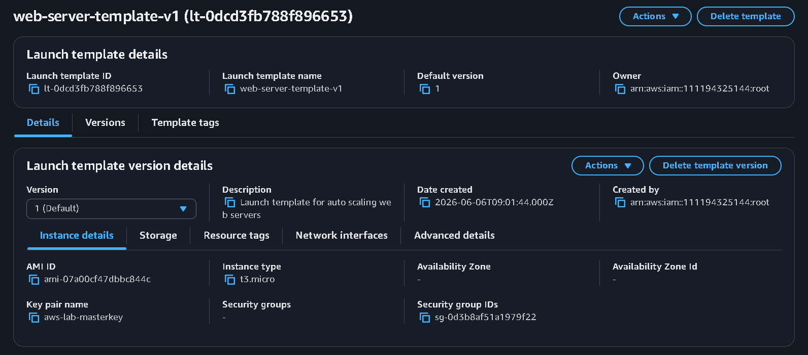

---

## Project Screenshots

### Target Group Health Checks

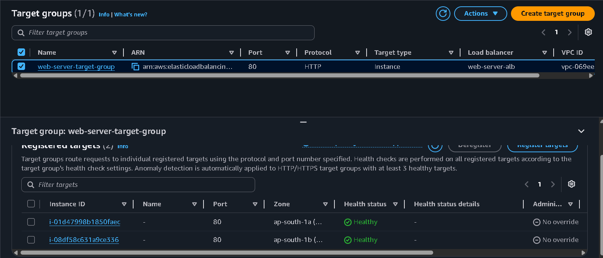

All instances registered with the target group are passing health checks successfully.

---

### Application Load Balancer

The Application Load Balancer distributes incoming traffic across multiple EC2 instances running in different Availability Zones.

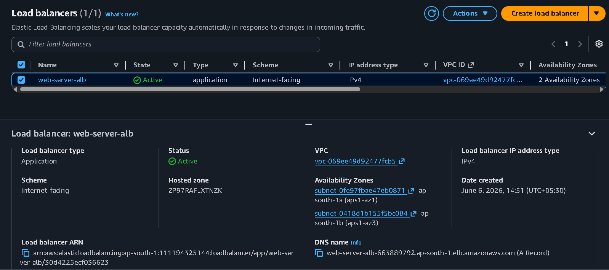

When I hit the load-balancer's domain then I get this instance
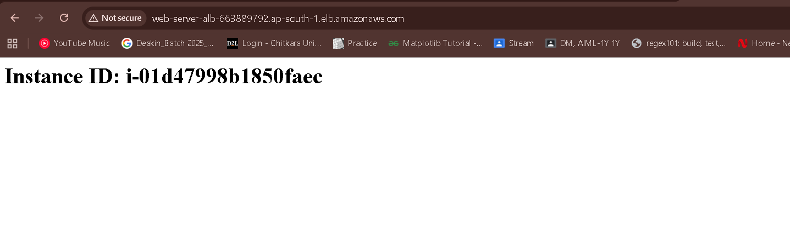
When i refresh the site then I am redirected to another instance as shown below


---

## Auto Scaling Demonstration

A CPU stress test was performed on the application servers.
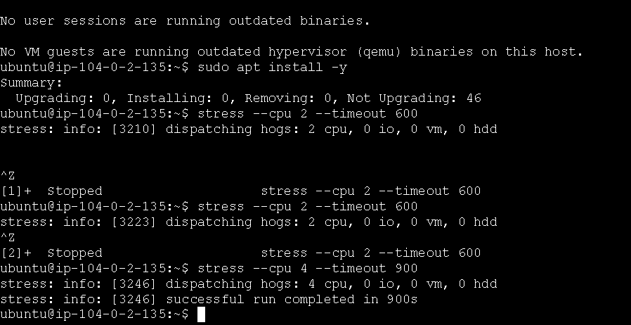
When average CPU utilization exceeded the configured threshold:
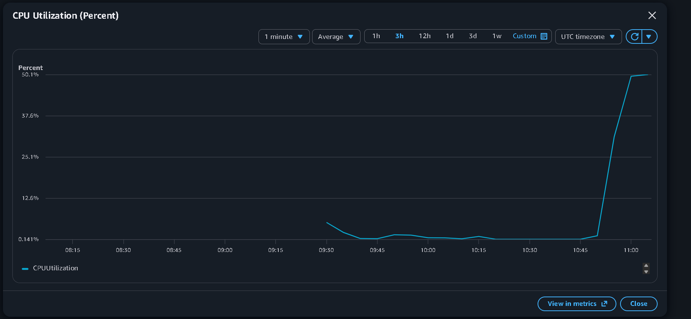

- CloudWatch detected increased CPU usage
- Auto Scaling Group launched an additional EC2 instance
- The new instance was automatically registered with the Target Group
- The Application Load Balancer began routing traffic to the new instance
  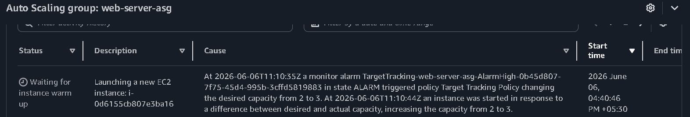

- This resulted in the launch of new instance that is visible on the dashboard.
  

This demonstrates automatic scaling and self-healing infrastructure.

---

## Results

The final architecture successfully demonstrated:

- Traffic distribution across multiple EC2 instances
- Automatic instance replacement after health check failures
- Dynamic scaling based on CPU utilization
- High availability across multiple Availability Zones
- Automated server provisioning using Launch Templates and User Data

  ---

## Learning Outcomes

Through this project I learned:

- AWS VPC Networking
- Internet Gateways
- Route Tables
- Security Groups
- EC2 User Data Automation
- IMDSv2 Metadata Service
- Infrastructure Troubleshooting
- Infrastructure Documentation
- Application Load Balancers
- Target Groups and Health Checks
- Auto Scaling Policies
- CloudWatch Monitoring
- High Availability Architecture

---

## Project Status

✅ Completed

Current Progress:

- [x] GitHub Repository Created
- [x] Custom VPC Created
- [x] Public Subnet 1 Created
- [x] Public Subnet 2 Created
- [x] Internet Gateway Attached
- [x] Route Table Configured
- [x] Security Group Configured
- [x] EC2 Bootstrap Automation
- [x] IMDSv2 Metadata Integration
- [x] Launch Template
- [x] Target Group
- [x] Application Load Balancer
- [x] Auto Scaling Group
- [x] CloudWatch Dashboard
- [x] Stress Testing
- [x] Architecture Diagram
- [x] Final Documentation

---

## Future Improvements

- HTTPS using AWS Certificate Manager
- Route53 custom domain integration
- CI/CD pipeline using GitHub Actions
- Infrastructure as Code using Terraform
- CloudWatch Alarms and SNS notifications

  ---

## Author

Yashwardhan Rathaur
