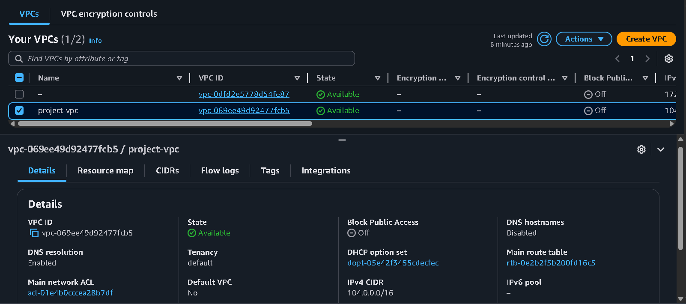
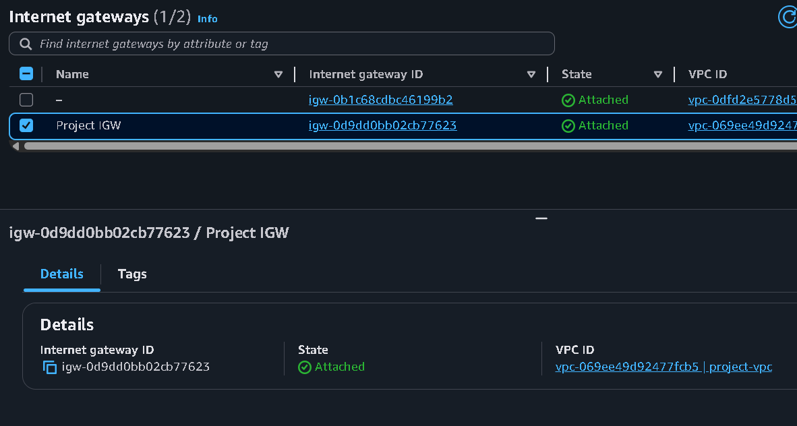
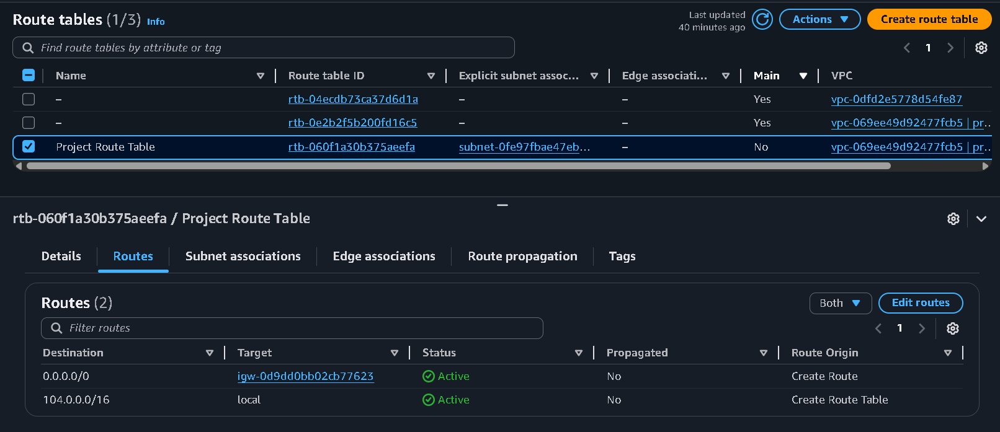
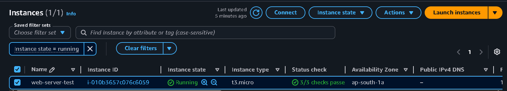

# AWS Auto Scaling Project

## Overview

This project demonstrates a highly available and self-healing web application architecture on AWS using:

- Amazon EC2
- Launch Templates
- Auto Scaling Groups (ASG)
- Application Load Balancer (ALB)
- CloudWatch Monitoring

The infrastructure automatically scales based on CPU utilization and replaces unhealthy instances to maintain availability.

---

## Architecture

Detailed architecture planning is documented in:

- [architecture-notes.md](architecture-notes.md)

Architecture diagram will be added after the Auto Scaling implementation is completed.

---

## Features

- High Availability
- Automatic Scaling
- Load Balancing
- Health Checks
- Self-Healing Infrastructure
- CloudWatch Monitoring

---

## AWS Services Used

| Service | Purpose |
|----------|----------|
| EC2 | Application Servers |
| Launch Template | Instance Configuration |
| Auto Scaling Group | Automatic Scaling |
| Application Load Balancer | Traffic Distribution |
| CloudWatch | Monitoring & Metrics |
| Security Groups | Network Security |

---

## Networking Setup

The project uses a custom VPC with public subnets distributed across multiple Availability Zones.

### Components

- Custom VPC
- Public Subnet 1
- Public Subnet 2
- Internet Gateway
- Public Route Table

### Screenshots








---

## Security Configuration

A dedicated security group was created for web servers.

### Inbound Rules

| Protocol | Port | Purpose |
|----------|------|----------|
| TCP | 22 | SSH Administration |
| TCP | 80 | HTTP Web Traffic |


---

## EC2 Automation

A test EC2 instance was deployed to validate infrastructure automation.

### Bootstrap Process

The User Data script automatically:

- Updates packages
- Installs Apache
- Retrieves EC2 metadata
- Generates a dynamic webpage

### Validation

The deployed instance successfully generated a webpage displaying its own Instance ID.




---

## Troubleshooting

### IMDSv2 Metadata Access Issue

During testing, metadata retrieval initially failed with:

```text
401 Unauthorized
```

The issue occurred because the EC2 instance required IMDSv2 authentication.

The bootstrap script was updated to retrieve an IMDSv2 token before accessing instance metadata.

This improvement made the automation compatible with modern AWS security standards.

---

## Learning Outcomes

Through this project I learned:

- AWS VPC Networking
- Internet Gateways
- Route Tables
- Security Groups
- EC2 User Data Automation
- IMDSv2 Metadata Service
- Infrastructure Troubleshooting
- Infrastructure Documentation

---

## Project Status

🚧 In Progress

Current Progress:

- [x] GitHub Repository Created
- [x] Custom VPC Created
- [x] Public Subnet 1 Created
- [x] Public Subnet 2 Created
- [x] Internet Gateway Attached
- [x] Route Table Configured
- [x] Security Group Configured
- [x] EC2 Bootstrap Automation
- [x] IMDSv2 Metadata Integration
- [ ] Launch Template
- [ ] Target Group
- [ ] Application Load Balancer
- [ ] Auto Scaling Group
- [ ] CloudWatch Dashboard
- [ ] Stress Testing
- [ ] Architecture Diagram
- [ ] Final Documentation

---

## Author

Yashwardhan Rathaur
